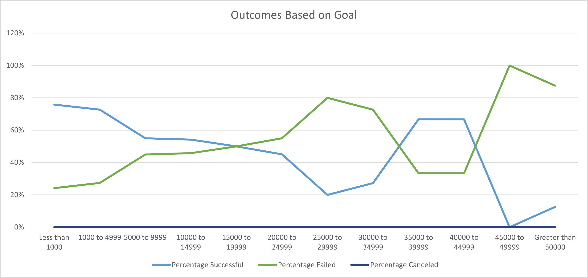

# An Analysis of Kickstarter Campaigns.

## Overview of Project
This project is to do analysis of Kickstarter campaign data to identify trends for Theater category to help set up campaign in future that has higher propbabilty of meeting the goal.

### Purpose
The purpose is to know how different campaigns fared in relation to their launch dates and their funding goals for Theater category.

## Analysis and Challenges

### Analysis of Outcomes Based on Launch Date

The campaigns for Theatre category have been most successful during the month of May. June and July take the second and third place respectively. The failed campaigns follow the same trend as successful campaigns except for the months of May, June, July and December. The percentage of success for any given month is greater than failure percentage except for the month of December. In December, the number of successful campaigns is almost equal to failed campaigns.

The canceled campaigns have a flat line and is not influenced by launch date except for the month of October. During October, there were no canceled campaigns.

Based on the above analysis, we can say that 
1. launching a campaign in month of May has more probability of success and 
2. launching a campaign in the month of December has almost equal probabilty of success and failure.

### Analysis of Outcomes Based on Goals
For this analysis, we filtered the data to only "Plays" subcategory in the Theatre Category. Looking at the data we can say that the highest probabilty of success for a "Plays" campaign is when the goal is less than $1,000. The next highest probabilty of success is for campaigns in the goal range of $1,000 to $4,999. Also, the dataset has highest number of campaigns in this range. We can see that the probability of success decreases as the goal amount keeps increasing until the goal amount of $35,000. The trend changes at this point and the probabilty of success goes up when the goal amount is in the range of $35,000 to $44,999. Please refer the graph below.

Based on the above analysis we can say that there is a higher probablity of success if a campaign for "Plays" subcategory if the goal is less than $5,000.

### Challenges and Difficulties Encountered
**Assumption:** The challenges and difficulties are with respect to completing this Module 1 Challenge.
 1. For me the biggest challenge was familiarizing myself with git (push & pull) and writing the Readme file with proper syntax.
 2. With respect to the analysis, I am still not sure what graph to use to represent the data I put together. The challenge said what graph to create but when I wanted to experiment some more I wasn't sure what graphs to use.

## Results

- What are two conclusions you can draw about the Outcomes based on Launch Date?
Based on the above analysis, we can say that launching a campaign is month of May has more probability of success and launching a campaign in the month of December has the similar probabilty of success as failure.

- What can you conclude about the Outcomes based on Goals?
Based on the above analysis we can conclude that if the goal is less $5000 then there is higher probabilty of success for a campaign in "Plays" subcategory.

- What are some limitations of this dataset?
The major data contributers for Theater category are AU, CA, GB & US. So, we need to consider country as a parameter when identifying trends.
Of these four countries, US is skewing the data.

- What are some other possible tables and/or graphs that we could create?
    1. We can create a table/graph to see goals versus pledged to see how close some of the failed campaigns.
    2. We can also create a table/graph to see number of backers versus average donation for success and failed campaigns.
