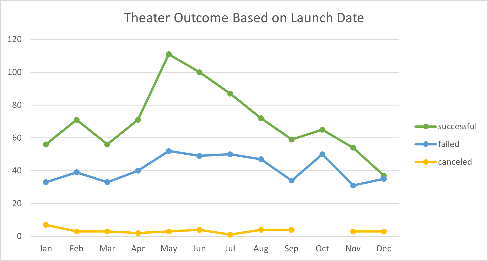

# An Analysis of Kickstarter Campaigns.

## Overview of Project
This project is to do analysis of Kickstarter campaign data to identify trends for Theater category to help set up campaign in future that has higher propbabilty of meeting the goal.

### Purpose
The purpose is to know how different campaigns fared in relation to their launch dates and their funding goals for Theater category.

## Analysis and Challenges

### Analysis of Outcomes Based on Launch Date

The campaigns for Theatre category have been most successful during the month of May. June and July take the second and third place respectively. The failed campaigns follow the same trend as successful campaigns except for the months of May, June, July and December. The percentage of success for any given month is greater than failure percentage except for the month of December. In December, the number of successful campaigns is almost equal to failed campaigns.

The canceled campaigns have a flat line and is not influenced by launch date except for the month of October. During October, there were no canceled campaigns.

Based on the above analysis, we can say that launching a campaign is month of May has more probability of success and launching a campaign in the month of December has the similar probabilty of success as failure.

### Analysis of Outcomes Based on Goals
For this analysis, we filtered the data to only "Plays" subcategory in the Theatre 

### Challenges and Difficulties Encountered

## Results

- What are two conclusions you can draw about the Outcomes based on Launch Date?
Based on the above analysis, we can say that launching a campaign is month of May has more probability of success and launching a campaign in the month of December has the similar probabilty of success as failure.

- What can you conclude about the Outcomes based on Goals?

- What are some limitations of this dataset?
The major data contributers for Theater category are AU, CA, GB & US. So, we need to consider country as a parameter when identifying trends.
Of these four countries, US is skewing the data.

- What are some other possible tables and/or graphs that we could create?
